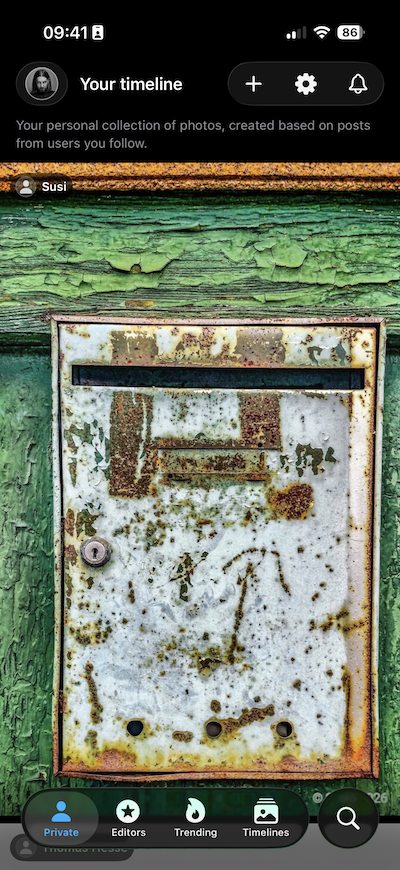
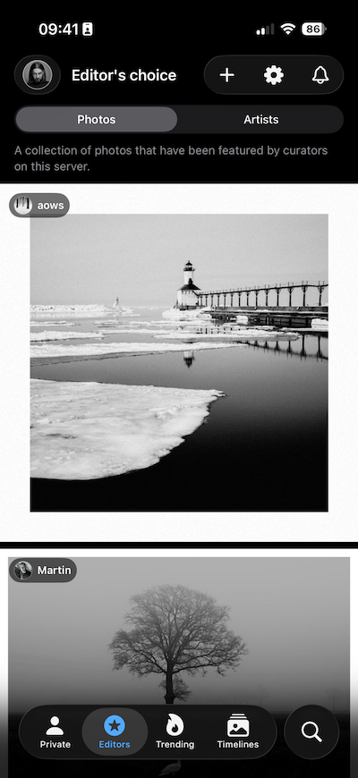
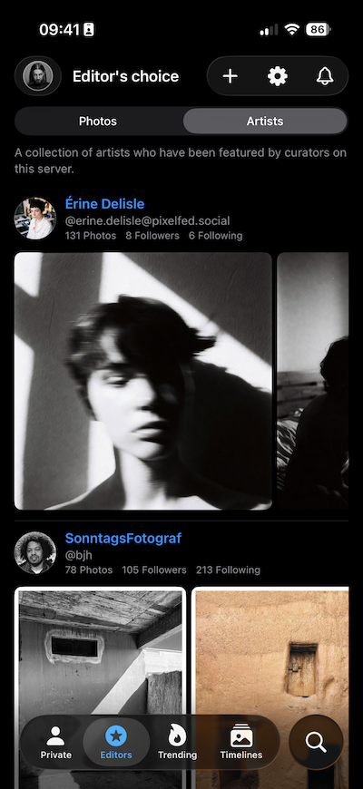
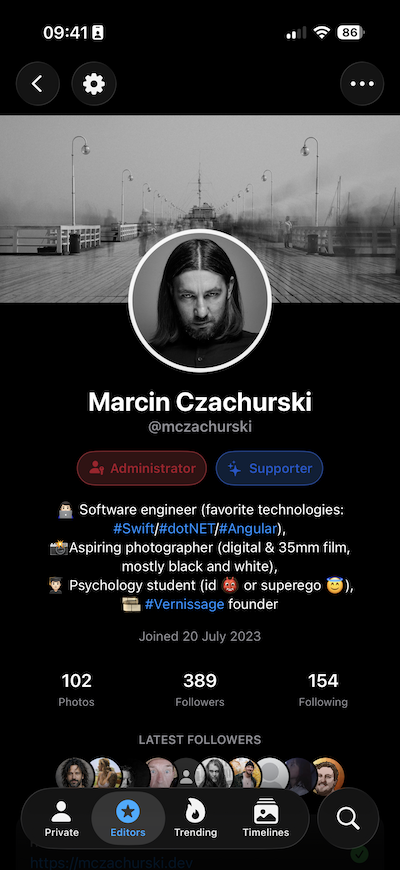

# Vernissage for iOS

   

**Vernissage** is a simple and intuitive **iOS client** for the Vernissage platform, focused on showcasing and sharing photos. With Vernissage, you can browse a timeline **dedicated to photos only** - no mixed media - so you can focus solely on discovering and enjoying beautiful photography.

The app features a **clean, minimalistic interface** designed to keep attention on the images. You can easily **like** and **comment** on photos, as well as **follow** other users to keep up with their latest posts.

Whether you're a professional photographer, an amateur enthusiast, or simply someone who loves to discover and share stunning photos - Vernissage is for you.

Built entirely in **SwiftUI**. Native iOS client for **Vernissage** - a community-driven, ad-free, algorithm-free photo sharing platform built for photographers and connected to the fediverse via **ActivityPub**.

Vernissage isn’t one big website - it’s a constellation of independent servers that can still follow each other across the fediverse (Mastodon, Pixelfed, and more).

---

## Where to start

- **Create an account:** https://vernissage.photos (or pick another server: https://joinvernissage.org/servers.html)
- **Project website:** https://joinvernissage.org
- **Documentation:** https://docs.joinvernissage.org
- **Source code (ecosystem):**
  - API server: https://github.com/VernissageApp/VernissageServer
  - Web client: https://github.com/VernissageApp/VernissageWeb

---

## Requirements

- macOS with **Xcode** (latest stable recommended)
- iOS Simulator or a physical iPhone
- (Optional) A local Vernissage backend for development

---

## Running the app (development)

1. Clone this repository.
2. Open the project in Xcode.
3. Select a simulator/device and press **Run**.

### Configuration

The app needs a **server base URL** (your “home” Vernissage server).

Typical examples:
- `https://vernissage.photos`
- `http://localhost:4200`
- `https://<your-server-domain>`

---

## Contributing

You can fork and clone repository. Change development team and bundle id. Do your changes and create a pull a request 👍.

Thank you in advance for any, even the smallest help, with the development of the project 💕!
